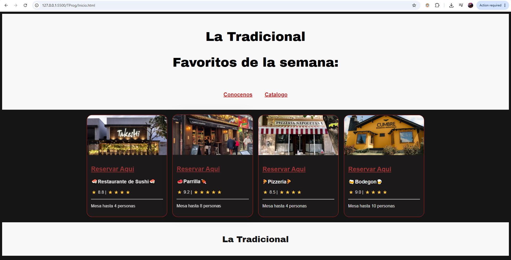
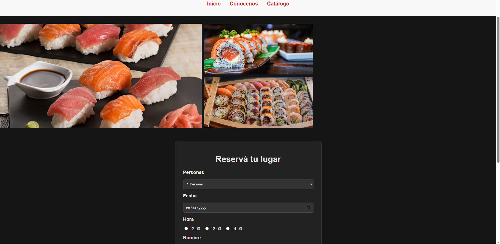
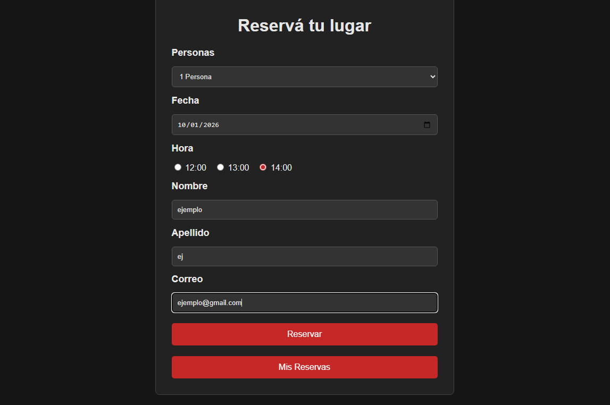
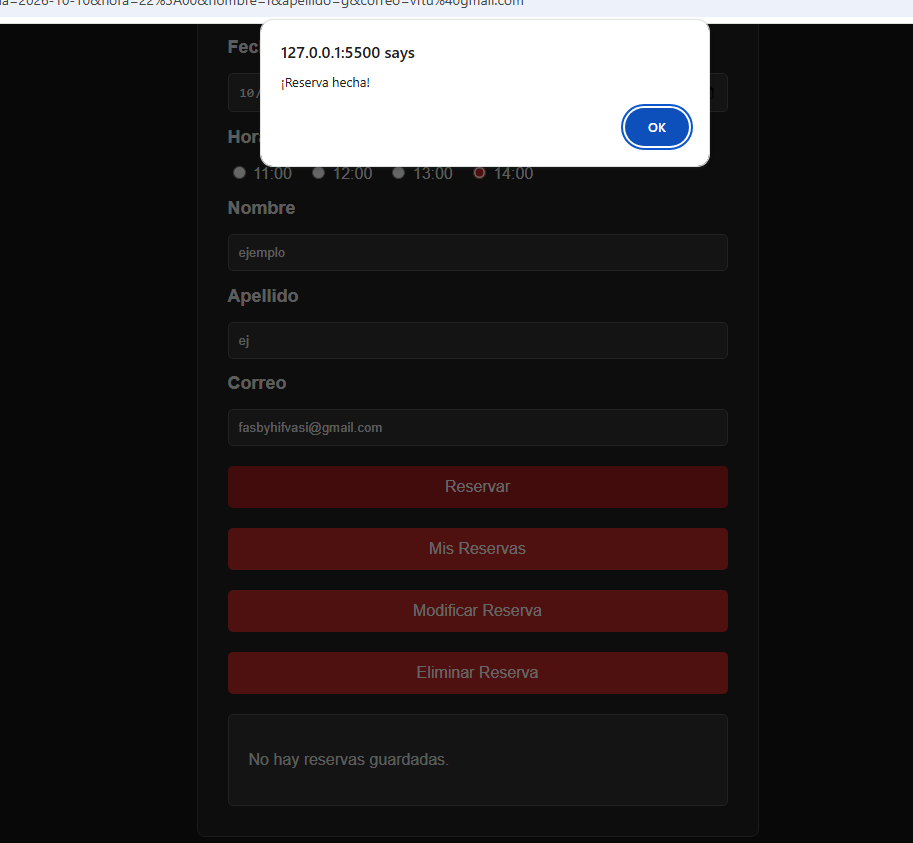

# TrabajoPracticoProg
Tp programacion 2026 II
Nuestro proyecto fue inspirado y basado en un sitio web de reservas, primeramente empezando por cuatro lugares para reservar, entre estos, pizzeria, bodegon, parrilla y restaurante de sushi.

siendo este el menu, estaria conformado primeramente por dos hrefs (conocenos, catalogo) mientras que tambien se encuentran las cuatro "tarjetas" principales, contando con un hover todos estos. Por ultimo, un footer con el nombre del sitio llamado "La Tradicional".

En las paginas para reservar se vuelven a encontrar los mismos hrefs colocados con un header (esta vez agregando otro href para el inicio), seguido por fotos ilustrativas de los platos, en este caso, sushi.

Las reservas se encuentran formadas por 6 campos (text, email, date, select, checkbox,), tambien cuenta con un boton para reservar y modificar la reserva.

una vez realizada la reserva, saldra un alert demostrando que la reserva fue guardada en el localStorage, dado el caso, tambien estara la opcion de eliminar y modificar la reserva si es necesario.

con esto podriamos tener por terminado el CRUD:
Create/Crear: guardar una reserva en el localStorage.
Read/Leer: obtener la reserva y mostrarla en "Mis Reservas".
Update/Actualizar: recuperar la reserva y cargar sus datos nuevamente en el formulario.
Delete/Eliminar: borrar la reserva del localStorage.

dejando esto en claro, nuestra division del trabajo fue:
css y javaScript: grupal
html:
bodegon: Matias villalba
Sushi: Facundo Ortiz
Parrilla: Simon Zacchino
Pizzeria: Ciro Sabariz
inicio, catalogo y conocenos: grupal
